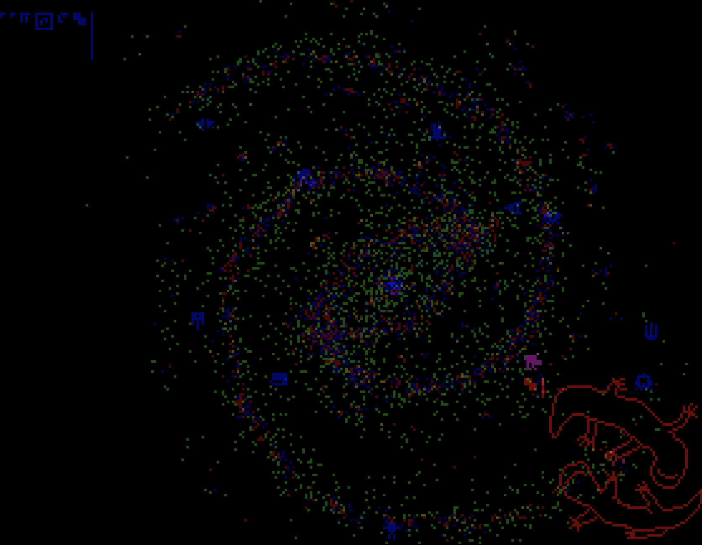

# ICFPC 2020

[ICFP Programming Contest 2020](https://icfpcontest2020.github.io/)用のリポジトリです。


```shellsession
# Galaxy evaluator
$ cd emu
$ sbt run
```

## 参加記

今回は初参加でしたが(ソロ)、Galaxy evaluatorを書いただけで終了してしまいました(コンテスト終了後Web UIを追加)。

* 2020-07-17 20:00 とりあえずリポジトリ作る
* 2020-07-18 20:52 sterter kit (Scala) を導入してsubmitしたりAPI叩いたり。たぶんLightning roundで2点入ったと思うが定かでなし
* 2020-07-18 20:00 コンテストおよびPegovkaのBlog読んで状況把握。言語仕様が与えられるので、処理系を作ってMessage #42を実行すれば何かがわかるらしいことはわかった
* 2020-07-19 01:59 Galaxy evaluator作るかってことで、Web UI使うことを見越してPlayのプロジェクト作成
* 2020-07-19 18:00 実装に取りかかる
* 2020-07-19 22:57 checkerboard命令で詰まる。どうやら遅延評価が必要らしい
* 2020-07-20 00:36 遅延評価実装してcheckerboard通す
* 2020-07-20 03:39 Message #37まで一通りの命令を実装(modulateとかsendとか必要なかったことに後から気づく)
* 2020-07-20 03:45 interact実装開始、Galaxyの動作テスト
* 2020-07-20 07:54 遅延評価のバグをようやく修正、Galaxy動いたので満足して寝る(おわり)

実働1日しかないやんけ、次回はもっと頑張りたい。

実装開始がほぼ三日目からというサボりぶりだったんですが、公式がevaluatorの実装やゲームに使うプロトコルなどをどんどんネタバレしだしたのでどうしようかと思った。


### 処理系の実装

実装すべき言語は型なしλ計算ベースでこんなかんじ:

```
expr          := number | function_name | var_name | apply
function_name := /[a-z][a-z0-9]+/
var_name      := /:[a-z0-9]+/
apply         := `ap` expr expr
```

組み込み関数が色々定義してあって、

```
ap ap add 1 2
#=> 3

ap ap cons 1 2
#=> (1 . 2)

ap ap cons ap neg 1 ap ap cons ap ap add 1 2 nil
#=> (-1, 3)
```

などができる。各種のコンビネータ関数で制御構造を実現。


[パーサ](emu/src/main/scala/Parser.scala)では空白で区切ってトークナイズし再帰的に式を読んで[AST](emu/src/main/scala/Tree.scala)構築。
後々使うので、関数名の表現には引数の数を含めておく(`add:2`、`neg:1`等)。

[評価機](emu/src/main/scala/Engine.scala)ではASTを読んで[値](emu/src/main/scala/V.scala)を生成。
関数呼び出しが遅延されているので、必要に応じて中身を評価して取り出す。

実装の概略としては、

```
eval expr = unwrap (eval_lazy expr)

eval_lazy Tree.Num(n)         = V.Num(n)
eval_lazy Tree.FunName1(name) = V.FunName1(name)
eval_lazy Tree.App(f, x)      = V.LazyApp(eval_lazy(f), eval_lazy(x))

unwrap value = cache.get_or_update(value, unwrap0(value))

unwrap0 V.LazyApp(f, x) = unwrap(f) match {
  case V.FunName1(name) => name match {
    case "neg" => V.Num(unwrap(x).as_int * -1)
    // ...
  }
  case V.FunName2(name) => V.FunApp2X(name, x)
  case V.FunApp2X(name, x1) => name match {
    case "add" => V.Num(unwrap(x1).as_int + unwrap(x).as_int)
    // ...
  }
  // 組み込み関数はたかだか3引数までなのでこの実装で充分
  case V.FunName3(name) => V.FunApp3X(name, x)
  case V.FunApp3X(name, x1) => V.FunApp3XX(name, x1, x)
  case V.FunApp3XX(name, x1, x2) => name match { ... }
```

みたいなかんじになりました。

* 関数適用は遅延
* 値が必要になったらキャッシュしつつ中身を計算する

というだけの話だが苦戦してしまった……

あとは変数を評価する時点ではまだ未定義だったりするのでこいつも遅延してやるとか、Consも関数として使えるのでapp可能にしてやるなど。

## Web UI

Evaluatorが動いたので、あとはgalaxyをprotocolとしてinteractすれば画像が帰ってくる。

二値画像複数枚を適当に着色してまとめる、本当はcanvas使うべきだけど1ピクセルあたりdiv一個として表示(重い)、クリックしたらその座標と現在の状態を元に再度interact走らす。
という処理を書いてこれを得た。



ICFPC・完！！！！！！！

(本当はこれでようやく入り口なんですが……)
